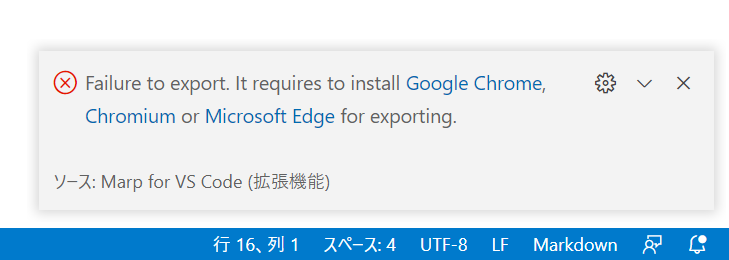

# Marp for VSCodeでPDF出力するための準備

---
<!--
    paginate: true
-->

## 発生現象

PDF化しようとした際に以下のエラーが出てPDF化出来ない場合の対処法。



---

## 流れ

1. Chromiumをインストールする
2. 日本語フォントをインストールする:smile:

---

### Chromiumをインストールする

```command
sudo apt-get update
sudo apt install chromium-browser
```

---

### 日本語フォントをインストール

```command
sudo apt install fonts-takao
sudo fc-cache -fv
fc-match TakaoGothic
```

インストールされているかどうかを確認

```command
$ fc-match TakaoGothic
TakaoGothic.ttf: "TakaoGothic" "Regular"
```

---

## 参考サイト

- Ubuntu Desktop (20.04/18.04) にフォントを追加インストールする！  
  <https://lab4ict.com/system/archives/879>
